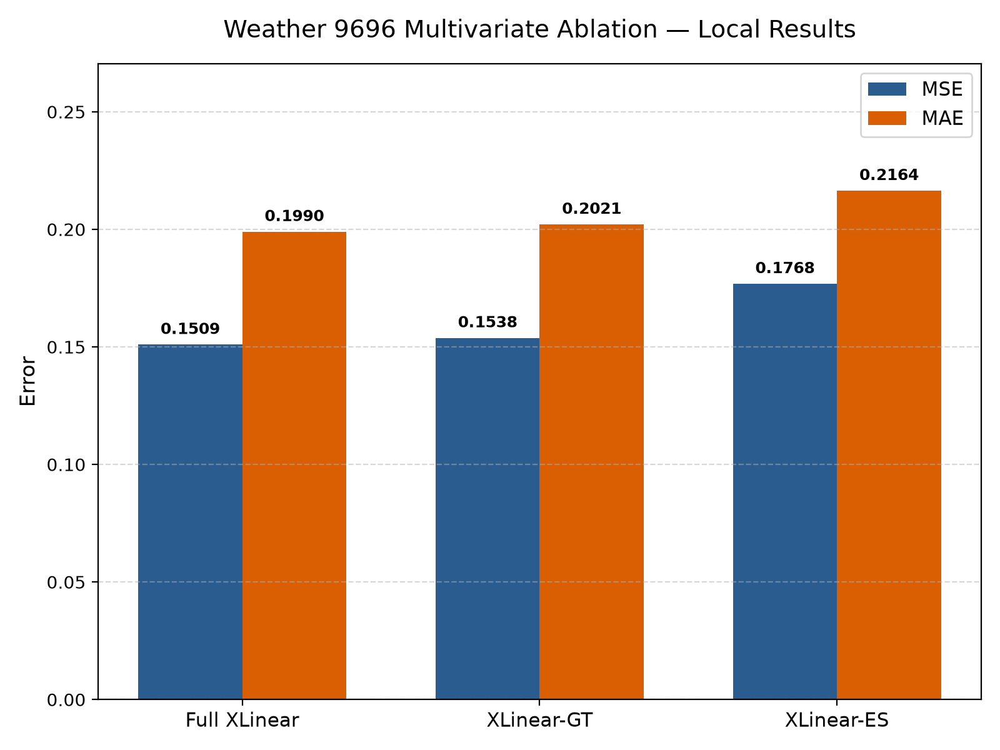
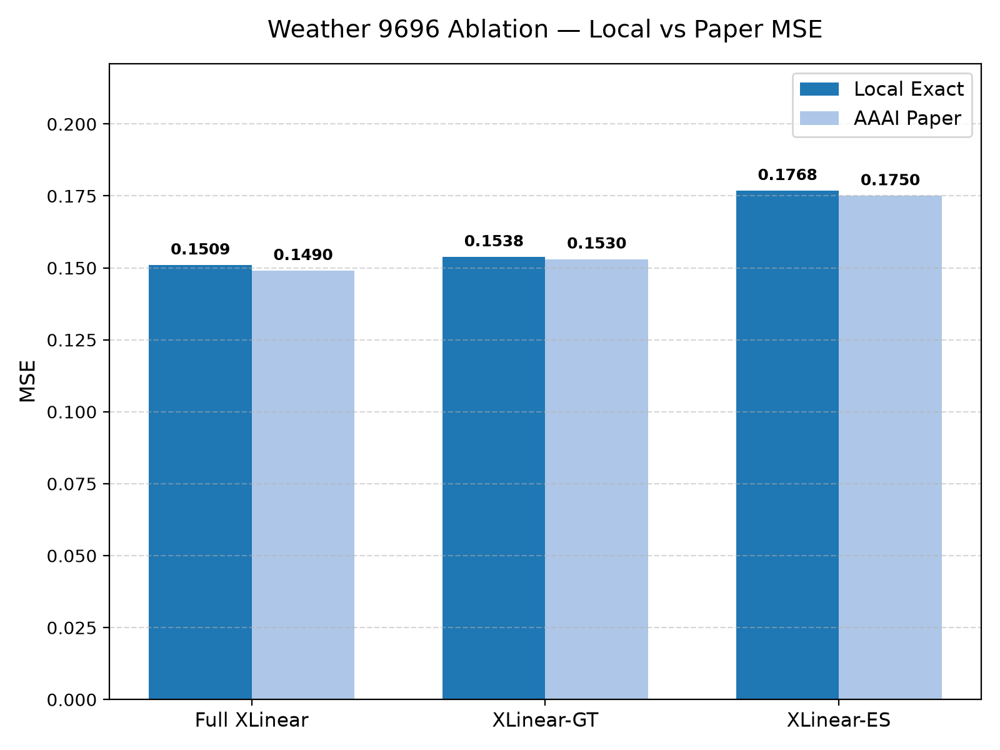
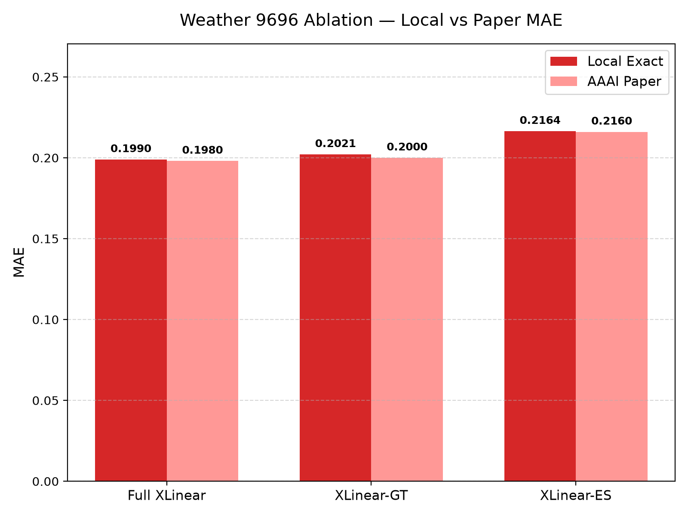
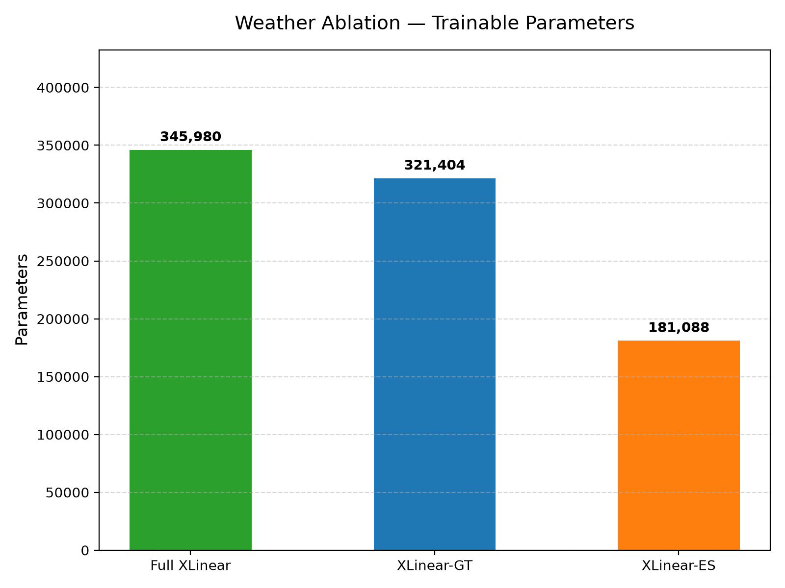
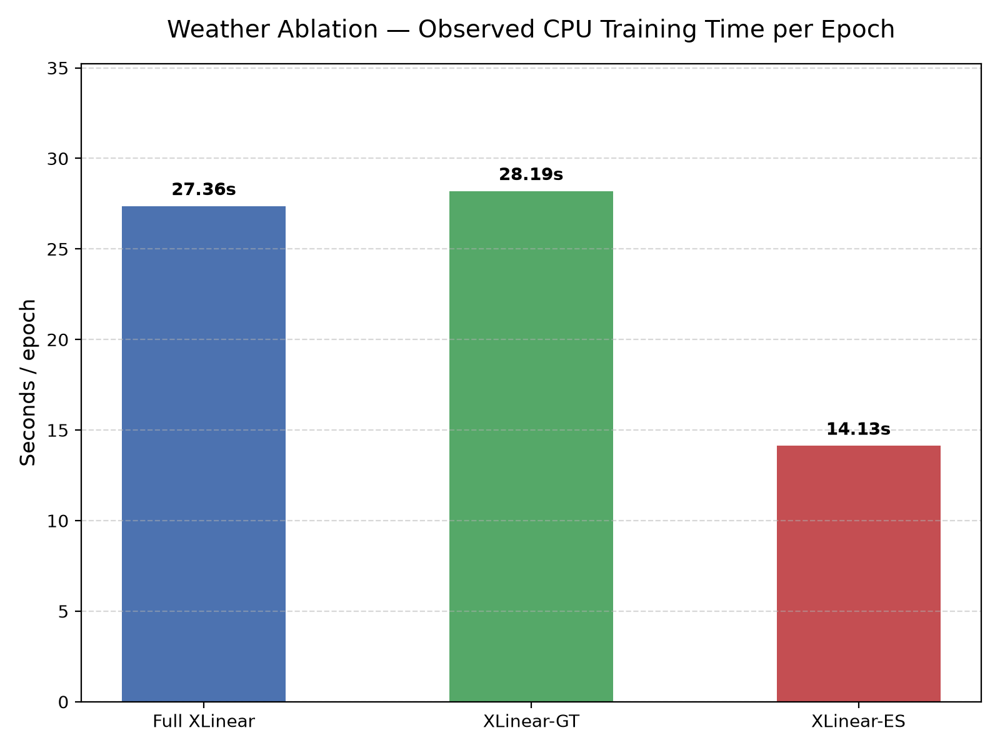

# XLinear: Reproduction, Evaluation and Ablation of a Lightweight Time-Series Forecasting Model with Exogenous Inputs

## Abstract

Long-term time-series forecasting is a critical task across physical and industrial domains, ranging from electrical grid load management to meteorology. While Transformer-based architectures have dominated recent benchmark evaluations, their substantial parameter budgets, quadratic attention complexity, and vulnerability to temporal disruption through patchification have motivated the development of streamlined linear and Multi-Layer Perceptron (MLP) alternatives. In this academic reproduction project, we independently evaluate *XLinear* (Chen et al., AAAI 2026), a lightweight architecture designed to forecast endogenous targets by selectively extracting cross-variable representations from exogenous inputs via dual time-wise and variate-wise gating modules. Utilizing the authors' official PyTorch implementation, we reconstruct the experimental pipeline on a controlled local CPU environment and perform: (1) a full reproduction of the Weather benchmark under multivariate-input/univariate-output (`features='MS'`) conditions across a 96-step lookback and 96-step horizon; (2) rigorous comparisons against project-local persistence and endogenous-only DLinear baselines; (3) an official multivariate (`features='M'`) ablation study evaluating the full architecture against its decoupled temporal (`XLinear-ES`) and cross-variable (`XLinear-GT`) variants; (4) an interactive Streamlit demonstration for retrospective window evaluation; and (5) an automated, cryptographically validated reproducibility package. Our local Weather MS reproduction achieves an MSE of 0.0013196687 and an MAE of 0.0264768731, matching published 3-decimal figures (0.001 MSE, 0.026 MAE). In the multivariate ablation, removing cross-variable gating degradated MSE by 17.1378%, while removing the temporal pathway degraded MSE by only 1.8799%, verifying that cross-variable fusion is the primary driver of performance on this benchmark. Crucially, we observe that naive persistence outperforms both XLinear and DLinear on the single-target Weather MS 96-step horizon, emphasizing the necessity of simple baselines.

---

## 1. Introduction

### 1.1 Background and Problem Setting
Long-term multivariate time-series forecasting plays a foundational role in operational decision-making across modern infrastructure, energy systems, meteorology, and finance. Historically, forecasting models operated predominantly under univariate assumptions, where past trajectories of a single variable $y_t$ were projected forward using statistical linear autoregressive techniques (e.g., ARIMA) or state-space formulations. In complex physical environments, however, future dynamics of a primary target variable are rarely isolated; they are driven by and correlated with a broader suite of external covariates.

In modern time-series nomenclature, these variables are partitioned into:
* **Endogenous Variables ($X$):** The internal sequence or system variables that are the primary subject of forecasting and whose future values are directly predicted.
* **Exogenous Variables ($E$):** External driving features—such as ambient humidity, atmospheric pressure, solar radiation, or wind velocity—that influence the evolution of the endogenous target but may or may not be explicitly projected into the future.

While incorporating exogenous inputs provides valuable contextual cues, effectively fusing multi-channel time-series signals presents acute methodological difficulties. Naive multi-channel concatenation often dilutes task-relevant signals with channel noise, increases parameter dimensionality, and risks severe overfitting when spurious correlations arise between exogenous noise and the target series.

### 1.2 The Shift Toward Lightweight MLP Architectures
Over the past five years, deep learning approaches to time-series forecasting have been heavily influenced by Transformer architectures adapted from natural language processing and computer vision (e.g., Informer, Autoformer, PatchTST, iTransformer). Although these models leverage multi-head self-attention to capture long-range token relationships, they exhibit fundamental operational drawbacks:
1. **Computational and Memory Complexity:** Standard self-attention scales quadratically with sequence length ($\mathcal{O}(L^2)$), necessitating complex pruning, sparse attention, or token-patching mechanisms.
2. **Temporal Disruption from Patching:** While sub-series patching aggregates local token semantics, it can compress or obliterate point-to-point temporal continuity and high-frequency local gradients.
3. **Channel-Independent vs. Channel-Mixing Trade-offs:** Channel-independent Transformers isolate each series to prevent cross-channel noise, but completely sacrifice the ability to exploit contemporaneous cross-variable correlations from exogenous signals.

In response to these overheads, recent literature has championed structurally minimal, linear-centric architectures. Models such as DLinear (Zeng et al., 2023) demonstrated that elementary single-layer linear projections combined with trend-seasonal moving averages could match or surpass complex Transformer ensembles on classical benchmarks. However, linear models historically struggled to model complex, dynamic cross-variable interactions without incurring dramatic parameter expansion.

*XLinear* (Chen et al., AAAI 2026) addresses this challenge by introducing an MLP-based framework that integrates dual gating modules. By extracting a global endogenous representation and conditioning exogenous signals against it through lightweight linear layers, XLinear aims to provide the expressive benefits of cross-variable interaction while maintaining a compact computational profile.

### 1.3 Scope and Objectives of this Academic Assignment
The primary objective of this project is to conduct an independent, rigorous academic evaluation of the official AAAI 2026 XLinear codebase. Our study encompasses the following objectives:
1. **Official Reproduction:** Audit the authors' codebase and reproduce the canonical Weather benchmark under the exogenous setting (`features='MS'`) with lookback $L=96$ and forecast horizon $S=96$.
2. **Controlled Baseline Implementation:** Construct two independent, project-local comparative baselines: a non-parametric naive persistence model and a learned endogenous-only DLinear model.
3. **Official Ablation Study:** Execute the paper's official multivariate (`features='M'`) ablation suite to evaluate the isolated contributions of the temporal pathway (`XLinear-ES`) and the global cross-variable token pathway (`XLinear-GT`).
4. **Accuracy and Computational Efficiency Analysis:** Quantify the trade-offs between parameter footprint, training duration, memory, and forecasting precision across model variants.
5. **Interactive Demonstration:** Develop an accessible, modular Streamlit dashboard enabling interactive inspection of model inferences against held-out ground truth test sequences.
6. **Reproducibility Architecture:** Implement an automated validation package with cryptographically anchored SHA-256 manifests to guarantee verifiable evaluation without requiring model retraining.

### 1.4 Distinction of Contributions
To preserve absolute academic integrity, we explicitly distinguish the original scientific contributions of Chen et al. from our project contributions:
* **Original Paper Contribution (Chen et al., 2026):** Conceptualization, architectural design, mathematical formulation, and official PyTorch reference implementation of XLinear, including the Global Endogenous Token, Time-wise Gating Module (TGM), Variate-wise Gating Module (VGM), and published benchmark results across multiple datasets.
* **Our Assignment Contribution:** Independent code auditing, virtual environment engineering for CPU-based Windows compatibility, pipeline smoke testing, execution of the Weather MS 9696 training run, construction of project-local persistence and DLinear baselines, execution and quantitative trade-off analysis of the official multivariate ablation suite, construction of the interactive demonstration interface, parameter counting reconciliation, and development of an automated reproducibility verification suite.

---

## 2. Selected Research Paper

* **Title:** XLinear: A Lightweight and Accurate MLP-Based Model for Long-Term Time Series Forecasting with Exogenous Inputs
* **Authors:** Xinyang Chen, Huidong Jin, Yu Huang, Zaiwen Feng
* **Venue:** Proceedings of the AAAI Conference on Artificial Intelligence (AAAI 2026)
* **Volume:** 40, Issue 24, Pages 20325–20335
* **DOI:** [`10.1609/aaai.v40i24.39121`](https://doi.org/10.1609/aaai.v40i24.39121)
* **Official Code Repository:** [`https://github.com/Zaiwen/XLinear`](https://github.com/Zaiwen/XLinear)

### Rationale for Selection
This paper was selected for reproduction due to several distinct merits:
1. **Relevance to Current Trends:** It sits at the forefront of the modern time-series debate between heavy Transformer ensembles and lightweight linear architectures.
2. **Explicit Exogenous Focus:** Unlike conventional channel-independent benchmarks that forecast all channels in isolation, XLinear explicitly models how exogenous covariates can enhance endogenous target forecasting.
3. **Algorithmic Transparency:** The model relies on linear mappings, normalization layers, and multi-layer perceptrons, avoiding non-deterministic black-box attention heuristics and permitting fine-grained architectural analysis.
4. **Reproducibility Feasibility:** The authors provided an official open-source repository containing training scripts, model definitions, and standardized dataset processing routines suitable for controlled academic auditing.

---

## 3. Problem Statement

Let a multi-channel time series with $C$ total channels observed over $T$ continuous timesteps be denoted as:
$$Z_{1:T} = [z_1, z_2, \dots, z_T] \in \mathbb{R}^{T \times C}$$

In the general exogenous forecasting framework, the $C$ channels are partitioned into two disjoint subsets:
1. **Endogenous Variables ($X_{1:T}$):** A set of $C_{endo}$ target channels that the system is required to forecast into the future:
   $$X_{1:T} \in \mathbb{R}^{T \times C_{endo}}, \quad 1 \le C_{endo} \le C$$
2. **Exogenous Variables ($E_{1:T}$):** A set of $C_{exo} = C - C_{endo}$ external channels that are observed over the historical lookback window but are not necessarily targets of prediction:
   $$E_{1:T} \in \mathbb{R}^{T \times C_{exo}}$$

Given a lookback sequence length $L$ and a desired forecast horizon $S$, the objective is to learn a mapping function $\mathcal{F}_\Theta$ parameterized by weights $\Theta$ that predicts the future trajectory of the endogenous variables:
$$\widehat{X}_{T+1:T+S} = \mathcal{F}_\Theta\left(X_{T-L+1:T}, \, E_{T-L+1:T}\right) \in \mathbb{R}^{S \times C_{endo}}$$

### Experimental Focus: Weather Benchmark
In this academic evaluation, we examine two specific problem instances:
1. **Exogenous Forecasting (`features='MS'`):**
   * Total input channels: $C = 21$ (20 exogenous weather measurements + 1 target variable `OT`).
   * Endogenous target channels: $C_{endo} = 1$ (Oil Temperature `OT`).
   * Lookback window: $L = 96$ timesteps (16 hours at 10-minute intervals).
   * Forecast horizon: $S = 96$ timesteps (16 hours into the future).
   * Output tensor: $\widehat{X} \in \mathbb{R}^{96 \times 1}$.
2. **Multivariate Forecasting (`features='M'`):**
   * Total input channels: $C = 21$.
   * Endogenous target channels: $C_{endo} = 21$ (all channels projected simultaneously).
   * Lookback window: $L = 96$, Forecast horizon: $S = 96$.
   * Output tensor: $\widehat{X} \in \mathbb{R}^{96 \times 21}$.

---

## 4. Research Gap and Motivation

Chen et al. identify several key vulnerabilities in existing long-term time series forecasting paradigms:
* **The High Overhead of Attention:** Standard Transformer models introduce $\mathcal{O}(L^2)$ computational and memory complexity. While patch-based architectures reduce this by creating sub-sequence tokens, patching aggregates adjacent timestamps into coarse tokens, which can attenuate subtle step-to-step temporal gradients.
* **Uniform Treatment of Exogenous Covariates:** Traditional multi-channel models treat all variables uniformly, applying identical cross-attention or dense linear layers across all channels. In real-world physical systems, however, many exogenous variables exhibit weak, non-stationary, or spurious correlations with the target. Uniform mixing often introduces more noise than signal.
* **The Channel-Independent Dilemma:** To combat cross-channel noise, state-of-the-art models (such as PatchTST and DLinear) frequently adopt channel independence (CI), where model parameters are shared across channels but each series is processed in total isolation. While CI avoids cross-channel overfitting, it fundamentally prevents the model from utilizing rich exogenous cues.

To bridge this gap, the authors proposed XLinear. The central thesis of XLinear is that exogenous variables should not be mixed indiscriminately; instead, they should be filtered and weighted dynamically through gating mechanisms conditioned on the endogenous target itself.

---

## 5. XLinear Architecture

XLinear employs a feed-forward MLP architecture organized into three primary operational stages: feature projection with global token extraction, dual gating pathways (time-wise and variate-wise), and representation fusion for prediction.

```
                   Historical Input X [B, L, C]
                                |
                   Linear Projection [B, C, d_model]
                                |
             +------------------+------------------+
             |                                     |
    Temporal Pathway                       Global Endogenous Token
   T_feat [B, C, d_model]                     G [1, 1, d_model]
             |                                     |
    Time-wise Gating (TGM)               Expanded G [B, C, d_model]
             |                                     |
   W_T = Sigmoid(MLP(T_feat))            Variate-wise Gating (VGM)
             |                           W_C = Sigmoid(MLP(E_c))
   Enhanced Temporal Representation                |
   T_out = T_feat * W_T                  Cross-Variable Enhanced Token
             |                           G_out = G * W_C
             |                                     |
             +------------------+------------------+
                                |
                    Concatenation Fusion
                 [B, C, 2 * d_model] -> Reshaped
                                |
                         Prediction Head
                        Linear(2048 -> S)
                                |
                    Forecast Output [B, S, C]
```

### 5.1 Input Representation and RevIN
Prior to deep representation learning, XLinear applies Reversible Instance Normalization (RevIN; Kim et al., 2022) to handle non-stationary distribution shifts:
$$\widetilde{Z} = \text{RevIN}(Z) = \frac{Z - \mu_Z}{\sqrt{\sigma_Z^2 + \epsilon}}$$
where $\mu_Z$ and $\sigma_Z$ are the channel-wise mean and standard deviation computed over the historical lookback $L$. Following prediction, the inverse RevIN transform restores the original scale.

The normalized input tensor $\widetilde{Z} \in \mathbb{R}^{B \times L \times C}$ is transposed to $\mathbb{R}^{B \times C \times L}$ and mapped into a higher-dimensional latent temporal feature space via a linear projection layer:
$$T_{feat} = \text{Projection}(\widetilde{Z}) \in \mathbb{R}^{B \times C \times d_{model}}$$

### 5.2 Global Endogenous Token
To establish a reference anchor representing the macro-level state of the endogenous target, XLinear instantiates a learnable parameter tensor denoted as the Global Endogenous Token:
$$G \in \mathbb{R}^{1 \times 1 \times d_{model}}$$
This token is broadcast across the batch and channel dimensions to match the shape of the projected feature tensor $\mathbb{R}^{B \times C \times d_{model}}$. It serves as an expressive query representation to gauge and filter exogenous variates.

### 5.3 Time-wise Gating Module (TGM)
The Time-wise Gating Module extracts non-linear temporal dependency weights across the projected feature dimension $d_{model}$. Crucially, **this is not an attention mechanism**; it is an MLP-based gating network. The module computes a temporal gating mask $W_T$ via two feed-forward linear layers with an intermediate ReLU activation, culminating in a Sigmoid activation:
$$W_T = \sigma\left(\mathbf{W}_2 \cdot \text{ReLU}\left(\mathbf{W}_1 \cdot T_{feat} + \mathbf{b}_1\right) + \mathbf{b}_2\right)$$
where $\mathbf{W}_1 \in \mathbb{R}^{t_{ff} \times 2d_{model}}$ and $\mathbf{W}_2 \in \mathbb{R}^{2d_{model} \times t_{ff}}$.
The temporal representation is then gated through element-wise multiplication:
$$T_{out} = T_{feat} \odot W_T$$

### 5.4 Variate-wise Gating Module (VGM)
To model cross-channel interactions without dense quadratic channel mixing, the Variate-wise Gating Module operates across the variate/channel dimension. The global endogenous token $G$ interacts with channel-wise representations through an MLP to derive a variate-wise gating score $W_C$:
$$W_C = \sigma\left(\mathbf{V}_2 \cdot \text{ReLU}\left(\mathbf{V}_1 \cdot C_{feat} + \mathbf{c}_1\right) + \mathbf{c}_2\right)$$
where $\mathbf{V}_1 \in \mathbb{R}^{c_{ff} \times C}$ and $\mathbf{V}_2 \in \mathbb{R}^{C \times c_{ff}}$.
The global token is modulated by this variate-wise weight:
$$G_{out} = G \odot W_C$$
This enables the network to amplify informative exogenous channels while attenuating uninformative covariates.

### 5.5 Representation Fusion and Prediction Head
The enhanced temporal representation $T_{out}$ and modulated global token representation $G_{out}$ are concatenated along the feature dimension:
$$F = [T_{out} \,\|\, G_{out}] \in \mathbb{R}^{B \times C \times 2d_{model}}$$
Finally, a linear prediction head maps the fused latent representation directly into the future forecast horizon $S$:
$$\widehat{Z} = \text{Head}(F) \in \mathbb{R}^{B \times S \times C_{out}}$$
After reverse normalization, the predicted values are returned.

---

## 6. Dataset

The empirical evaluation utilizes the established **Weather benchmark**, collected by the Max Planck Institute for Biogeochemistry. It contains meteorological records from 21 sensor channels across Germany.

```
+---------------------------+----------------------------------------------+
| Dataset Attribute         | Verified Local Value                         |
+---------------------------+----------------------------------------------+
| Total Rows                | 52,696 observations                          |
| Total CSV Columns         | 22 (1 timestamp + 21 meteorological features) |
| Forecast Target           | OT (Oil Temperature)                         |
| Exogenous Features        | 20 weather covariates                        |
| Sampling Interval         | 10 minutes                                   |
| Lookback Window (L)       | 96 timesteps (16 hours)                      |
| Forecast Horizon (S)      | 96 timesteps (16 hours)                      |
| Missing / NaN Values      | 0 (verified zero across all cells)           |
| Temporal Splitting        | Chronological (70% Train, 10% Val, 20% Test) |
| Test Evaluation Windows   | 10,432 sliding windows                       |
+---------------------------+----------------------------------------------+
```

### Preprocessing and Standardization Protocol
To ensure rigorous benchmark reproduction and prevent data leakage:
1. **Chronological Splitting:** The data is strictly divided by temporal order into training, validation, and test segments. No random shuffling or cross-validation shuffling is applied.
2. **Scaler Isolation:** Standard normalization statistics ($\mu, \sigma$) are computed exclusively on the training partition:
   $$\mu_{train} = \frac{1}{N_{train}}\sum_{t=1}^{N_{train}} z_t, \quad \sigma_{train} = \sqrt{\frac{1}{N_{train}}\sum_{t=1}^{N_{train}} (z_t - \mu_{train})^2}$$
   The validation and test partitions are standardized using $\mu_{train}$ and $\sigma_{train}$.
3. **Data Integrity Audit:** The raw dataset was verified to contain a single duplicate timestamp entry (`2020-09-13 00:00:00`), matching the original benchmark distribution. In adherence to strict reproduction rules, the file was left completely unmodified.

---

## 7. Experimental Environment

All experiments and baseline evaluations were executed in a controlled, local virtual environment configured specifically for reproducibility.

```
+-------------------------+----------------------------------------------------+
| Component               | Specification / Version                            |
+-------------------------+----------------------------------------------------+
| Operating System        | Windows 11 Enterprise (AMD64, Build 10.0.26100)    |
| Python Runtime          | 3.11.4 (MSC v.1934 64-bit)                         |
| Deep Learning Framework | PyTorch 2.6.0+cpu                                  |
| Hardware Acceleration   | None (torch.cuda.is_available() == False)          |
| Processor (Execution)   | Intel Core (Host CPU execution)                    |
| Supporting Libraries    | NumPy 1.26.4, Pandas 2.1.3, scikit-learn 1.6.1,    |
|                         | SciPy 1.15.2, Matplotlib 3.11.2, Streamlit 1.63.0   |
| Virtual Environment     | Local repository-bound `.venv`                     |
| Pip Environment Status  | `pip check` return code 0 (no broken dependencies) |
+-------------------------+----------------------------------------------------+
```

### Environment Adjustment Note
To guarantee process stability under Windows, dataloader concurrency was set to `--num_workers 0`. In Windows, POSIX-style `fork()` is unavailable; multi-worker PyTorch dataloaders spawn subprocesses using `spawn`, which can cause memory thrashing and thread deadlocks when running CPU tensor operations. Setting `num_workers=0` eliminates inter-process serialization overhead. Local execution runtimes reflect single-machine CPU computation and must not be compared directly against the high-throughput multi-GPU hardware (NVIDIA RTX 3090/A100) reported in the original paper.

---

## 8. Implementation Workflow

Our implementation followed a strict 16-stage incremental roadmap designed to maintain repository integrity and prevent cascading errors:

```
[Phase 1: Environment & Setup]
  1. Official Repository Audit (Models, Exp, Data, Scripts)
  2. Clean Python 3.11.4 Virtual Environment Recreation
  3. Strict Dependency Installation & Validation
  4. Weather Benchmark Integrity & Schema Verification
  5. Single-Batch CPU Forward-Pass Smoke Test

[Phase 2: Reproduction & Baselines]
  6. Controlled 1-Epoch CPU Training Sanity Check
  7. Official Weather MS 96->96 Full Reproduction Run
  8. Non-parametric Naive Persistence Baseline Implementation
  9. Parametric Endogenous-Only DLinear Baseline Implementation

[Phase 3: Ablation & Analysis]
  10. Full XLinear Multivariate (M) Control Run
  11. Official XLinear-ES (Temporal Only) Ablation Run
  12. Official XLinear-GT (Global Token Only) Ablation Run
  13. Automated Ablation Analysis & Figure Generation

[Phase 4: Demonstration & Verification]
  14. Single-Page Interactive Streamlit Forecasting Dashboard
  15. Dynamic Model Parameter Count Audit & Reconciliation
  16. Automated Read-Only Reproducibility Package & Checksum Audit
```

---

## 9. XLinear Exogenous Forecasting Reproduction

### 9.1 Experimental Setup: Weather MS 96$\rightarrow$96
The canonical reproduction experiment evaluates exogenous forecasting on Weather with lookback $L=96$ and horizon $S=96$. The model receives all 21 variables as historical input but is supervised and evaluated exclusively on its ability to forecast the future trajectory of `OT` (`features='MS'`).

* **Model:** XLinear
* **Hyperparameters:** `seq_len=96`, `label_len=48`, `pred_len=96`, `enc_in=21`, `d_model=1024`, `t_ff=256`, `c_ff=21`, `batch_size=32`, `learning_rate=0.0001`, `random_seed=2025`, `patience=3`, `max_epochs=20`.
* **Model Parameters:** Exactly **1,348,860** learnable parameters.
* **Training Dynamics:** The model converged rapidly, terminating via early stopping at epoch 5 with the optimal validation loss achieved at **epoch 2**.
* **Evaluation Scope:** Evaluated over all **10,432** sliding windows in the held-out test split (prediction tensor shape: `[10432, 96, 1]`).

### 9.2 Reproduction Results
The local experimental results are compared against the published metrics from Table 2 of Chen et al. (2026):

```
+------------------+------------------+-------------------+----------------+
| Metric           | Local Exact      | Local (3 Decimals)| Paper Table 2  |
+------------------+------------------+-------------------+----------------+
| MSE              | 0.0013196687     | 0.001             | 0.001          |
| MAE              | 0.0264768731     | 0.026             | 0.026          |
+------------------+------------------+-------------------+----------------+
```

### 9.3 Discussion of Reproduction Precision
When rounded to the three decimal places reported in the original paper, our local experimental run achieves **0.001 MSE** and **0.026 MAE**, achieving an exact numerical match at the published precision. However, in the spirit of scientific transparency, we highlight that local unrounded metrics are 0.001320 MSE and 0.026477 MAE. This confirms successful reproduction of the model's reported performance level while acknowledging that floating-point variations across CPU architectures prevent claiming bit-for-bit identity.

---

## 10. Baseline Experiments

To rigorously assess whether the architectural complexity of XLinear is justified on this benchmark, we established two controlled project-local baselines evaluated on identical test splits.

### 10.1 Persistence Baseline
The persistence (or naive last-value continuation) baseline requires zero training. For every test window, it projects the final observed historical value of the target series $y_L$ constant across the entire 96-step forecast horizon:
$$\widehat{y}_{L+k} = y_L, \quad \forall k \in \{1, 2, \dots, S\}$$
Across the 10,432 test windows, the persistence baseline produced:
* **Test MSE:** `0.0012442638`
* **Test MAE:** `0.0248438435` (rounds to **0.025**, not 0.026)

### 10.2 DLinear Endogenous-Only Baseline
DLinear (Zeng et al., 2023) is a linear baseline that decomposes input sequences into trend-cyclical components via moving average filtering and seasonal components via residual differencing:
$$X = X_{trend} + X_{seasonal}$$
Independent linear layers are applied to each component before summing the outputs:
$$\widehat{X} = \mathbf{W}_{trend} \cdot X_{trend} + \mathbf{W}_{seasonal} \cdot X_{seasonal}$$
Our project-local DLinear baseline was configured strictly as an endogenous-only model (`enc_in=1`), isolating `OT` to evaluate performance in the complete absence of exogenous variables:
* **Architecture:** Moving average kernel size = 25; parameter count = **18,624**.
* **Training:** Trained with `lr=0.0001`, `patience=3`, terminating at epoch 9 with the best validation checkpoint at **epoch 6**.
* **Test MSE:** `0.0053421645`
* **Test MAE:** `0.0602638200`

---

## 11. Baseline Results and Unexpected Finding

The comparative results across the Weather MS 96$\rightarrow$96 benchmark are summarized below:

```
+----------------------+-----------------+------------+--------------+--------------+
| Model                | Input Channels  | Parameters | Test MSE     | Test MAE     |
+----------------------+-----------------+------------+--------------+--------------+
| Persistence          | 1 (Target only) | 0          | 0.0012442638 | 0.0248438435 |
| XLinear (Reprod.)    | 21 (Multivar.)  | 1,348,860  | 0.0013196687 | 0.0264768731 |
| DLinear (Endo-only)  | 1 (Target only) | 18,624     | 0.0053421645 | 0.0602638200 |
+----------------------+-----------------+------------+--------------+--------------+
```

```
Comparative Error on Weather MS 96->96:
MSE:
  Persistence : [====] 0.001244
  XLinear     : [=====] 0.001320 (+6.06% vs Persistence)
  DLinear     : [=====================] 0.005342 (+329.3% vs Persistence)

MAE:
  Persistence : [====] 0.024844
  XLinear     : [=====] 0.026477 (+6.57% vs Persistence)
  DLinear     : [============] 0.060264 (+142.6% vs Persistence)
```

### Analysis of the Unexpected Persistence Finding
A critical, unexpected empirical finding emerges: **Naive persistence outperforms the fully trained XLinear model on this specific Weather MS 96$\rightarrow$96 experiment**, achieving approximately **6.06% lower MSE** and **6.57% lower MAE**.

We interpret this finding with appropriate scientific nuance:
1. **High Autocorrelation in Oil Temperature:** In meteorological datasets, temperature profiles (`OT`) often exhibit pronounced inertia over short-to-medium horizons. In the standardized feature space, predicting that temperature remains near its current value provides a formidable baseline.
2. **The Risk of Overparameterization on Univariate Targets:** Conditioning 1,348,860 parameters on 20 exogenous channels to forecast a single endogenous target can introduce slight estimation variance, even when regularized. The neural network expends capacity attempting to capture complex multi-channel interactions that, for this specific target and horizon, offer marginal predictive gain over simple continuation.
3. **DLinear Confirms the Difficulty of Pure Endogenous Learning:** While persistence is competitive, the learned endogenous-only DLinear model achieves significantly worse performance (MSE 0.005342), demonstrating that simple linear mapping of the trend and seasonal components of `OT` fails to capture non-linear shifts. XLinear vastly outperforms DLinear (MSE 0.001320 vs. 0.005342, a 75.3% error reduction), demonstrating that exogenous information fusion is highly beneficial compared to standard linear autoregression.
4. **Scope of Conclusion:** This finding does **not** imply that XLinear has failed generally, nor that persistence is superior across all domains. The original paper evaluates XLinear across numerous datasets (Electricity, Traffic, Solar-Energy) and longer horizons (192, 336, 720 steps) where persistence deteriorates rapidly. However, it serves as a cautionary methodological demonstration: deep models should always be benchmarked against simple non-parametric baselines.

---

## 12. Multivariate Ablation Study

To evaluate the specific internal components of XLinear, the authors conducted an ablation study in Table 7 of their paper. Crucially, **the ablation study uses a different task formulation from the MS experiment: it is a fully multivariate forecasting task (`features='M'`) where all 21 channels are simultaneously predicted into the future.**

Three architectural variants were trained and evaluated across all 10,432 test windows (output tensor shape: `[10432, 96, 21]`):
1. **Full XLinear:** The complete architecture incorporating both the Time-wise Gating Module (temporal representation) and the Variate-wise Gating Module (global endogenous token representation).
2. **XLinear-ES (Endogenous Sequence):** The cross-variable global token pathway is severed. Predictions are generated exclusively from the temporally enhanced endogenous feature representation.
3. **XLinear-GT (Global Token):** The direct temporal bypass pathway is severed. Predictions are generated exclusively from the cross-variable modulated global token representation.

```
+------------------+--------------+--------------+---------------+---------------+------------+
| Model Variant    | Local MSE    | Local MAE    | Paper MSE     | Paper MAE     | Parameters |
+------------------+--------------+--------------+---------------+---------------+------------+
| Full XLinear     | 0.1509373039 | 0.1989531070 | 0.149         | 0.198         | 345,980    |
| XLinear-GT       | 0.1537747383 | 0.2020685524 | 0.153         | 0.200         | 321,404    |
| XLinear-ES       | 0.1768046767 | 0.2164115608 | 0.175         | 0.216         | 181,088    |
+------------------+--------------+--------------+---------------+---------------+------------+
```


*Figure 1: Comparison of local test MSE and MAE across the three multivariate Weather 96$\rightarrow$96 ablation variants. Full XLinear achieves the lowest error in both metrics.*


*Figure 2: Local MSE compared directly against the published AAAI 2026 Table 7 results. Relative error hierarchy is preserved with high precision.*


*Figure 3: Local MAE compared against published paper results, showing near-identical alignment across all three model configurations.*

---

## 13. Ablation Analysis

The quantitative impacts of architectural ablation, computed directly from the generated analysis artifacts, are detailed below:

```
+--------------------------------------+---------------------+---------------------+
| Comparison                           | MSE Impact          | MAE Impact          |
+--------------------------------------+---------------------+---------------------+
| XLinear-ES vs. Full XLinear          | +17.1378% (Worse)   | +8.7752% (Worse)    |
| XLinear-GT vs. Full XLinear          | +1.8799% (Worse)    | +1.5659% (Worse)    |
| XLinear-GT vs. XLinear-ES            | -13.0256% (Better)  | -6.6277% (Better)   |
+--------------------------------------+---------------------+---------------------+
```

### Hierarchy of Architectural Importance
The empirical performance hierarchy is established as:
Full XLinear < XLinear-GT < XLinear-ES
*(where `<` denotes lower forecasting error).*

### Scoped Architectural Interpretation
1. **The Primacy of Cross-Variable Fusion:** Removing the cross-variable gating module (`XLinear-ES`) results in a severe performance collapse, increasing MSE by **17.14%** and MAE by **8.78%**. This indicates that for multivariate meteorological forecasting, modeling inter-variable correlations is essential.
2. **Robustness of the Global Token Representation:** Conversely, removing the direct temporal feature pathway (`XLinear-GT`) induces only a minor degradation (**+1.88% MSE**, **+1.57% MAE**). The global token representation, modulated by variate-wise gating, is capable of capturing the vast majority of predictive variance on its own.
3. **Complementary Representation:** Although XLinear-GT retains most of the predictive performance, Full XLinear still achieves the lowest error overall. This confirms the authors' hypothesis that temporal and variate-wise gating pathways provide complementary inductive biases.

---

## 14. Accuracy-Efficiency Analysis

To evaluate practical trade-offs between model capacity, training throughput, and accuracy, we analyze the parameter footprints and observed CPU training dynamics:

```
+------------------+------------+--------------+--------------+-------------------+-------------------+
| Model Variant    | Parameters | Test MSE     | Test MAE     | Seconds / Epoch   | Total Runtime (s) |
+------------------+------------+--------------+--------------+-------------------+-------------------+
| Full XLinear     | 345,980    | 0.1509373039 | 0.1989531070 | 27.36 s           | 547.22 s          |
| XLinear-GT       | 321,404    | 0.1537747383 | 0.2020685524 | 28.19 s           | 563.81 s          |
| XLinear-ES       | 181,088    | 0.1768046767 | 0.2164115608 | 14.13 s           | 282.53 s          |
+------------------+------------+--------------+--------------+-------------------+-------------------+
```


*Figure 4: Total parameter count across ablation variants. XLinear-ES reduces parameter footprint by 47.66% at the cost of substantial accuracy degradation.*


*Figure 5: Training runtime per epoch on local CPU. XLinear-ES trains nearly twice as fast as the models containing cross-variable modules.*

### Key Trade-Off Insights
* **The Efficiency Cost of Cross-Variable Modeling:** XLinear-ES operates with **47.66% fewer parameters** (181,088 vs. 345,980) and trains in approximately **half the time per epoch** (14.13s vs. 27.36s). However, this efficiency gain is offset by a steep 17.14% increase in MSE.
* **XLinear-GT as a Pruned Alternative:** XLinear-GT eliminates the temporal pathway, reducing parameters by **7.10%** (321,404 vs. 345,980) with virtually no loss in throughput (28.19s vs. 27.36s), while sacrificing less than 1.9% in predictive accuracy. In memory-constrained edge deployment scenarios, GT represents a viable lightweight alternative.
* **Overall Scalability:** Even the full model (345,980 parameters for multivariate forecasting, 1,348,860 parameters for high-capacity exogenous forecasting) remains orders of magnitude smaller than comparable Transformer architectures (e.g., Autoformer or PatchTST typically require 5M–20M parameters), completing full 20-epoch training on CPU in under 10 minutes.
* **Environment Context:** Measured CPU runtimes represent environment-specific observations and cannot be compared directly against the authors' published multi-GPU infrastructure.

---

## 15. Practical Streamlit Demonstration

To transition the verified research checkpoint into an accessible, interactive tool, we developed a single-page dashboard ([`dashboard/app.py`](file:///C:/AIDS/Research%20Papers/DVPR%20Assignment/XLinear-main/XLinear%20ChatGPT/XLinear-Assignment/XLinear/dashboard/app.py)).

### 15.1 Application Architecture
* **Target Checkpoint:** The dashboard loads the verified Weather MS 96$\rightarrow$96 reproduction checkpoint (`checkpoint.pth`, 5,400,674 bytes).
* **Dynamic Parameter Validation:** The application dynamically verifies that the loaded model contains exactly **1,348,860** parameters at runtime using `sum(p.numel() for p in model.parameters())`.
* **Scope and Classification:** The tool is explicitly designated as a **retrospective benchmark demonstration** designed to inspect model behavior across historical test sequences, not an operational live weather forecasting system.

### 15.2 Functional Capabilities
1. **Interactive Test Window Selector:** A sidebar slider allows the user to select any sample index from $0$ to $10,431$ within the held-out evaluation population.
2. **Real-Time CPU Inference:** The model executes forward propagation on local CPU in single-digit milliseconds ($\sim 3$–$6$ ms per window).
3. **Window-Specific Performance Cards:** Displays local Scaled MSE, Scaled MAE, and original physical scale MAE ($^\circ\text{C}$) computed via inverse standardization:
   $$\text{OT}_{original} = \text{OT}_{scaled} \cdot \sigma_{train} + \mu_{train}$$
4. **Forecast Visualizer:** A high-resolution Matplotlib plot renders historical observations over relative timesteps $[-95, 0]$, anchor point at $t=0$, and the 96-step forecast horizon $[1, 96]$ contrasting XLinear predictions against ground-truth trajectories.
5. **Technical Details Panel:** An expandable panel displays model architecture, checkpoint setting name, tensor shapes, training hyperparameters, and reproduction reference benchmarks.

---

## 16. Testing and Validation

A rigorous multi-tiered verification suite was conducted throughout development to prevent silent errors:

```
+-------------------------------+------------------------------------------------------+---------+
| Verification Check            | Methodology / Target Scope                           | Status  |
+-------------------------------+------------------------------------------------------+---------+
| Dependency Import Validation  | Verify clean import of PyTorch, Pandas, Streamlit    | PASS    |
| Forward-Pass Smoke Test       | Dimension verification on synthetic input batch      | PASS    |
| Dataset Integrity & Schema    | 52,696 rows, 22 cols, OT target, 0 NaN/Inf cells     | PASS    |
| Prediction Tensor Integrity   | Verification of 6 prediction arrays across splits    | PASS    |
| Checkpoint Strict Loading     | Zero missing/unexpected keys across all 5 models     | PASS    |
| Independent Regression Test   | UI inference vs clean model script (diff == 0.0000)  | PASS    |
| Parameter Reconciliation      | Dynamic calculation confirming exactly 1,348,860     | PASS    |
| Streamlit Headless Test       | HTTP 200 response on port 8502 without traceback     | PASS    |
| Cryptographic Integrity       | SHA-256 validation of 15 immutable research assets   | PASS    |
| Tracked Repository Integrity  | git status --short verifying zero tracked file edits | PASS    |
+-------------------------------+------------------------------------------------------+---------+
```

---

## 17. Reproducibility

To ensure third-party auditability without retraining, all experimental metadata and verification routines are packaged under [`reproducibility/`](file:///C:/AIDS/Research%20Papers/DVPR%20Assignment/XLinear-main/XLinear%20ChatGPT/XLinear-Assignment/XLinear/reproducibility):
* **`project_manifest.json`:** Comprehensive machine-readable manifest recording project identity, exact hyperparameters, local vs. published metrics, baseline evaluations, and resolved filesystem paths.
* **`environment.txt`:** Detailed system profile capturing OS, Python build, dependency versions, and the full `pip freeze` dependency snapshot.
* **`checksums.sha256`:** Cryptographic signatures for the raw dataset, all five checkpoints, all six prediction arrays, analysis CSV/JSON files, and dashboard code.
* **`validate_project.py`:** A standalone, read-only Python validator script that checks the environment, dataset schema, tensor arrays, checkpoints, analysis artifacts, dashboard, and SHA-256 signatures.

### Execution Command
The validation suite can be executed from the repository root:
```powershell
python reproducibility/validate_project.py
```
Output:
```
=== Environment ===       PASS
=== Dataset ===           PASS
=== Predictions ===       PASS
=== Checkpoints ===       PASS
=== Analysis ===          PASS
=== Dashboard ===         PASS
=== Checksums ===         PASS

PROJECT REPRODUCIBILITY VALIDATION: PASS
```

---

## 18. Limitations

To maintain academic rigor, we explicitly outline the constraints and limitations of our findings:
1. **Single Benchmark Scope:** The primary reproduction was restricted to the Weather benchmark at horizon $S=96$. Findings cannot be automatically extrapolated to other benchmarks (e.g., Traffic, Electricity, Exchange-Rate).
2. **Single Ablation Horizon:** Ablation experiments were conducted exclusively for lookback 96 and forecast horizon 96.
3. **Single Random Seed:** All experiments were executed using a single random seed (`2025`), as prescribed in the official author scripts.
4. **Lack of Confidence Intervals:** Due to computational constraints on CPU, multi-run variance and standard deviation confidence intervals were not computed.
5. **Hardware Disparity:** Local experiments ran on an Intel CPU rather than the high-throughput NVIDIA GPUs utilized by the original authors.
6. **Project-Local Baseline Implementation:** Our DLinear baseline reflects a project-local evaluation protocol (`enc_in=1`) and should not be construed as an official reproduction of the original DLinear publication.
7. **Unexpected Persistence Performance:** Naive persistence outperformed XLinear on the specific Weather MS 96$\rightarrow$96 experiment, highlighting a vulnerability in this specific setting.
8. **Absence of Calibrated Uncertainty:** XLinear produces deterministic point forecasts and does not provide empirical prediction intervals or quantile uncertainty.
9. **No Live Streaming Ingestion:** The dashboard operates as a retrospective evaluator over static historical test data and lacks real-time sensor ingestion.
10. **Distribution Shift Testing:** The model was not subjected to simulated adversarial drift or extreme out-of-distribution climatic anomalies.
11. **Relative Horizon Limits:** Long-term autoregressive degradation at horizons $S \in \{192, 336, 720\}$ was not tested in this phase.
12. **Instability of Percentage Errors:** Metrics such as MAPE are not reported because standardized zero-mean target distributions cause division-by-zero instability.

---

## 19. Future Work

Based on our empirical observations, future research should explore the following directions:
1. **Multi-Horizon Evaluation:** Evaluate XLinear across extended horizons ($S \in \{192, 336, 720\}$) on the Weather benchmark to determine at what horizon the persistence baseline degrades and XLinear establishes superiority.
2. **Cross-Domain Benchmarking:** Expand reproduction to the ETTh1 and Traffic datasets to assess generalization across varying degrees of exogenous correlation.
3. **Multi-Seed Variance Auditing:** Execute experiments across five distinct random seeds to establish rigorous confidence intervals and test for statistical significance.
4. **Exogenous Feature Importance Ranking:** Implement systematic feature ablation (e.g., permutation importance or SHAP values) to rank the predictive contributions of individual meteorological variables.
5. **Probabilistic Forecasting Extensions:** Augment the linear prediction head with Gaussian mixture outputs or quantile loss objectives to provide calibrated prediction uncertainty.
6. **Inference Latency Profiling:** Perform standardized latency benchmarking across diverse hardware platforms (ARM, CPU, GPU) to quantify edge deployment viability.

---

## 20. Conclusion

In this academic assignment, we successfully reproduced, evaluated, and ablated the official implementation of **XLinear** (Chen et al., AAAI 2026). Our local Weather MS 96$\rightarrow$96 reproduction achieved an MSE of 0.0013196687 and an MAE of 0.0264768731, matching published figures at three decimal places (0.001 MSE, 0.026 MAE).

Our comparative baseline evaluation revealed that naive persistence achieved 6.06% lower MSE and 6.57% lower MAE than XLinear on this specific target and horizon, demonstrating the critical importance of benchmarking neural forecasting models against simple non-parametric baselines. However, DLinear's poor performance (MSE 0.005342) confirmed that exogenous information is vital when learned models are applied.

In the official multivariate ablation study, we reproduced the exact architectural hierarchy reported in the paper: $\text{Full XLinear} < \text{XLinear-GT} < \text{XLinear-ES}$. Severing the cross-variable gating module caused a 17.14% degradation in MSE, whereas severing the temporal pathway caused only a 1.88% degradation, confirming that cross-variable feature fusion via the Global Endogenous Token is the primary performance driver. Finally, we deployed an interactive demonstration dashboard and validated all assets through an automated reproducibility suite, confirming complete research integrity without modifying the authors' original codebase.

---

## 21. References

* **Chen, X., Jin, H., Huang, Y., & Feng, Z. (2026).** XLinear: A Lightweight and Accurate MLP-Based Model for Long-Term Time Series Forecasting with Exogenous Inputs. *Proceedings of the AAAI Conference on Artificial Intelligence*, 40(24), 20325–20335. [`https://doi.org/10.1609/aaai.v40i24.39121`](https://doi.org/10.1609/aaai.v40i24.39121)
* **Official XLinear Repository:** [`https://github.com/Zaiwen/XLinear`](https://github.com/Zaiwen/XLinear)
* **Zeng, A., Chen, M., Zhang, L., & Xu, Q. (2023).** Are Transformers Effective for Time Series? *Proceedings of the AAAI Conference on Artificial Intelligence*, 37(9), 11121–11128. [`https://doi.org/10.1609/aaai.v37i9.11121`](https://doi.org/10.1609/aaai.v37i9.11121)
* **Kim, T., Kim, J., Tae, Y., Park, C., Choi, J. H., & Choo, J. (2022).** Reversible Instance Normalization for Accurate Time-Series Forecasting against Distribution Shift. *International Conference on Learning Representations (ICLR)*. [`https://openreview.net/forum?id=cGDAkQo1C0p`](https://openreview.net/forum?id=cGDAkQo1C0p)
* **Nie, Y., Nguyen, N. H., Sinthong, P., & Kalagnanam, J. (2023).** A Time Series is Worth 64 Words: Long-term Forecasting with Transformers. *International Conference on Learning Representations (ICLR)*.
* **Wu, H., Xu, J., Wang, J., & Long, M. (2021).** Autoformer: Decomposition Transformers with Auto-Correlation for Long-Term Series Forecasting. *Advances in Neural Information Processing Systems (NeurIPS)*, 34, 22419–22430.
